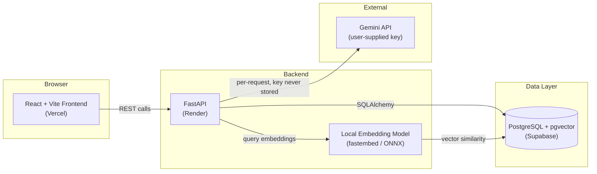
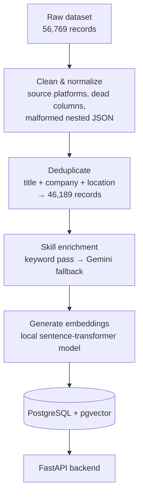

# AI-Powered Job Board

An AI-powered job discovery platform built for AlmaBetter's Research Analyst Round 1 technical assignment — job aggregation, AI-driven skill tagging, resume-based recommendations, semantic search, and a conversational assistant, deployed end-to-end on free-tier infrastructure.

**🔗 Live App:** https://job-board-fawn-one.vercel.app
**⚙️ API Docs (Swagger):** https://job-board-z2i5.onrender.com/docs
**📹 Explanation Video:** https://drive.google.com/file/d/1jAsrFzQrQxWHtAp_sInLbm6aZ3A8zwv2/view?usp=drive_link
**💻 Source:** https://github.com/suryanshu-g/Job_Board

> **Note on first load:** the backend runs on a free-tier instance that sleeps when idle. The very first request after a period of inactivity may take 20–30 seconds to wake up — this is expected free-tier behavior, not a bug. Subsequent requests are fast.

---

## Overview

Most job boards stop at "list jobs and let people filter." This one treats the dataset as raw material for a real product pipeline: clean it, enrich it with AI where the raw data falls short, understand it semantically, and use it to have an actual conversation with the candidate about fit — not just keyword matches.

The project was built and evaluated against a provided dataset of **56,769 scraped job records**, deliberately processed rather than taken at face value — roughly a fifth of the fields needed correction, deduplication, or enrichment before they were usable, and that data-quality work is a first-class part of this build, not an afterthought.

---

## Features

| Requirement | What was built |
|---|---|
| Multi-platform job data integration | Dataset ingested, cleaned, and deduplicated into PostgreSQL — no scraping, as specified |
| Job-source filtering | Dropdown built from the dataset's real, normalized platform list (64 platforms) |
| AI-based classification & tagging | Hybrid keyword + Gemini LLM skill extraction, structured filters |
| Personalized recommendations | Resume upload → skill extraction → explainable, scored job matches |
| AI Job Assistant | Conversational assistant with user-supplied Gemini key, multi-job comparison, full error handling |
| Semantic search | Natural-language job search via local sentence embeddings + pgvector |
| Deployed, public, working | Live on Vercel + Render + Supabase, all free tier |

---

## Architecture



## Data Pipeline



---

## Technology Stack

**Backend:** Python, FastAPI, SQLAlchemy, PostgreSQL, pgvector, `fastembed` (ONNX-based local embeddings), Gemini API
**Frontend:** React, TypeScript, Vite, Tailwind CSS, shadcn/ui
**Infrastructure:** Supabase (database), Render (backend hosting), Vercel (frontend hosting) — all free tier, no Docker required for this scope
**AI:** Gemini (`gemini-3.5-flash-lite`) for skill enrichment and the conversational assistant; `all-MiniLM-L6-v2` (via ONNX) for semantic search embeddings

---

## Setup / Run Locally

**Backend**
```bash
cd backend
python -m venv venv
venv\Scripts\activate        # Windows
pip install -r requirements.txt
cp .env.example .env         # fill in DATABASE_URL
uvicorn app.main:app --reload
```

**Frontend**
```bash
cd frontend
npm install
cp .env.example .env         # fill in VITE_API_URL
npm run dev
```

The live app requires no setup — visit the deployed link above and use your own free Gemini API key (get one at [Google AI Studio](https://aistudio.google.com)) to try the assistant.

---

## How the AI Components Work

### 1. AI-Based Skill Tagging
Rather than sending all ~46,000 job descriptions through an LLM (slow and expensive), skills are extracted in two stages:
- **Keyword pass** — a domain-tuned skill vocabulary, built by analyzing the frequency of real skill terms already present in the dataset, resolves the majority of records instantly and for free.
- **Gemini fallback** — only for records the keyword pass can't resolve. This kept LLM usage proportional to actual need rather than brute-forcing every record through an API call.

### 2. Personalized Recommendations
Resumes are parsed (PDF text extraction + skill matching) and compared against each job's tagged skills using **Jaccard similarity** — chosen over embeddings for this specific step because it's fast, requires no external dependency at request time, and produces a result that's directly explainable: every recommendation returns the exact matched skills, missing skills, and a plain-language reason, not a black-box score. Jobs without enriched skill data still surface via a domain/category fallback, scored deliberately lower so they never outrank a job with genuine skill overlap.

### 3. Semantic Search
Every job description is embedded once (locally, via a compact ONNX-based sentence-transformer model) and stored as a vector in Postgres via `pgvector`. Search queries are embedded the same way and matched by cosine similarity — so a query like *"remote entry-level python roles"* finds relevant jobs by meaning, not just keyword overlap.

### 4. AI Job Assistant
A conversational assistant scoped to specific jobs and the candidate's resume. Users supply their **own** Gemini API key, entered per-session and never persisted server-side — sent only as a request header, never logged, never written to disk. This was a deliberate security choice, not just a compliance checkbox: it also means the app's usability isn't bottlenecked by a shared API quota.

---

## Known Constraints & Trade-offs

These are deliberate scoping decisions made under real time and infrastructure constraints, not oversights — each was a conscious call, and each is something I can walk through the reasoning for.

- **Infrastructure is sized for evaluation, not production traffic.** This deployment runs on free-tier hosting (Supabase, Render, Vercel), comfortably handling a small number of concurrent evaluators. It was not engineered for high-throughput production load — for example, `/recommend` scores candidates against the job set on each request rather than through a caching or precomputation layer, which was an acceptable trade-off at this scale but wouldn't be at real scale.
- **Skill enrichment coverage is high but not exhaustive.** Of the ~9,300 jobs that lacked usable skill data in the raw dataset, the majority are now resolved through the two-stage pipeline above; a documented remainder is intentionally left unenriched due to free-tier LLM quota limits rather than run indefinitely across many days. These records still work correctly in recommendations — they fall back to domain/category matching rather than being excluded.
- **Semantic search favors broad-theme queries over narrow single-skill ones.** Compact local embedding models are excellent at distinguishing broad domains (a Python-heavy role vs. a data-science-heavy role) but can occasionally under-rank a query built around one specific skill buried inside an otherwise-unrelated job description. Verified and root-caused, not guessed at — a similarity-threshold fix was tested and mathematically confirmed insufficient before this was accepted as a model-level trade-off rather than a bug to chase further.
- **Session-only by design.** No user accounts, no persisted resume data, no saved search history — every session starts clean. This matches the assignment's scope and avoids storing personal data (resumes, API keys) unnecessarily.
- **The dataset's actual source platforms differ from the assignment brief's examples.** The brief references LinkedIn/Naukri/Indeed/Internshala; the real provided dataset's platform mix is different (LinkedIn, BeBee, Trabajo.org, Glassdoor, and others). The platform filter reflects the real, cleaned data rather than the brief's illustrative names.

---

## Project Structure

```
job-board-final/
├── backend/
│   ├── app/
│   │   ├── routers/        # API endpoints
│   │   ├── schemas/        # Pydantic request/response models
│   │   ├── services/       # Business logic (recommender, resume parser, Gemini client)
│   │   ├── models.py       # SQLAlchemy models
│   │   └── main.py
│   ├── data_pipeline/      # One-time ingestion/enrichment scripts (dataset → clean DB)
│   ├── sanity_check.py     # Automated endpoint test suite
│   └── requirements.txt
└── frontend/
    └── src/
        ├── pages/          # Jobs, Job Detail, Recommendations, Assistant
        ├── components/
        ├── context/        # Session-only resume & job-selection state
        └── lib/            # Typed API client
```

---

## Author

Built as part of AlmaBetter's Research Analyst Round 1 technical assignment.
